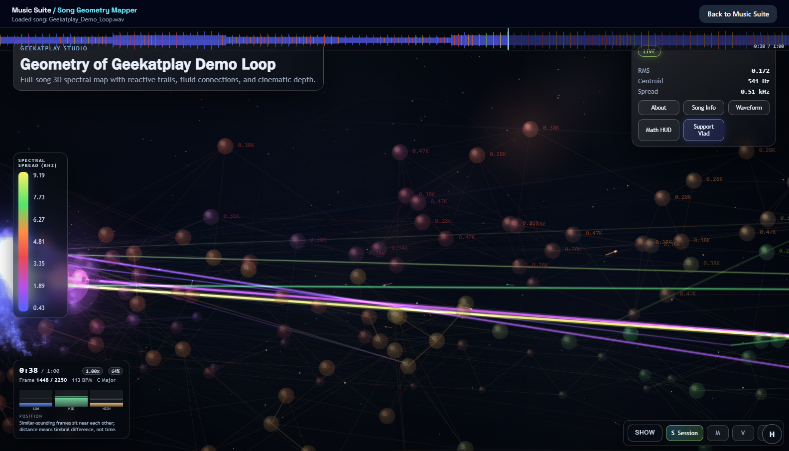
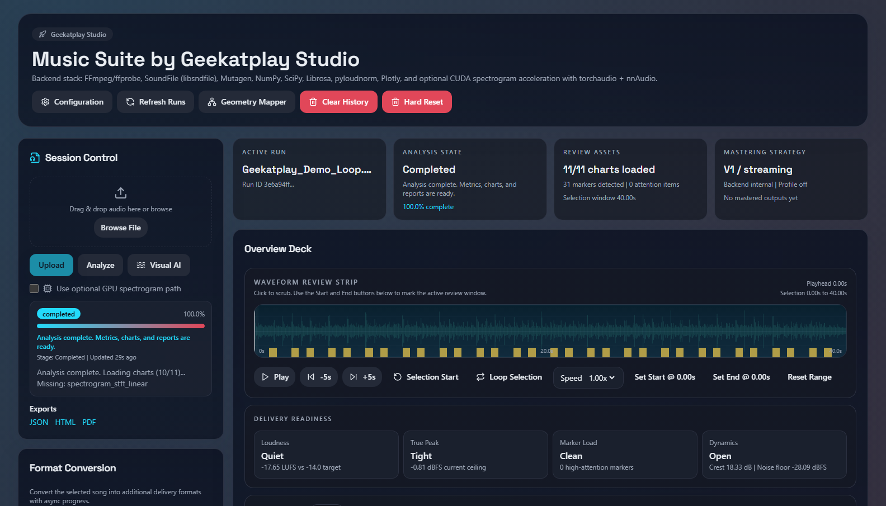
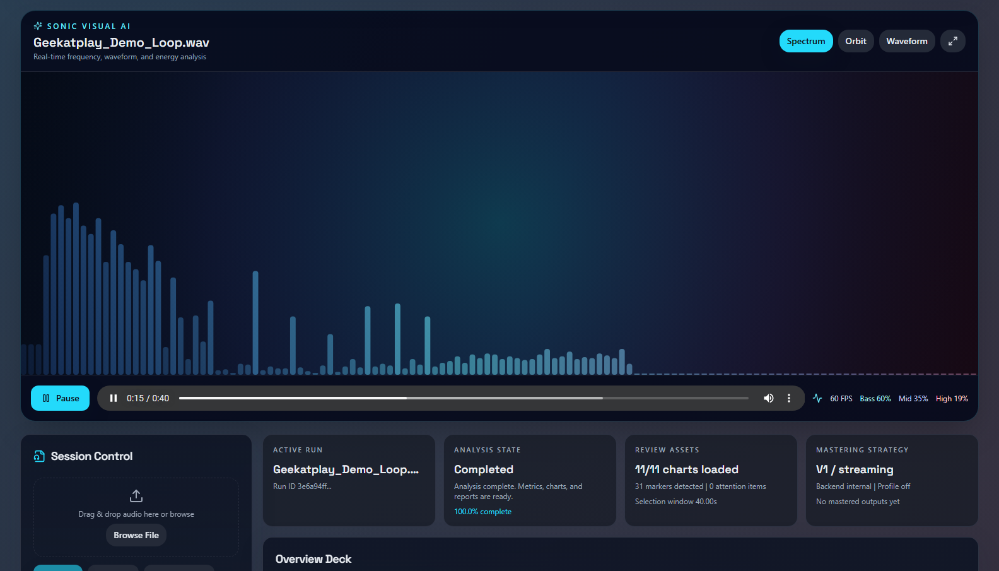
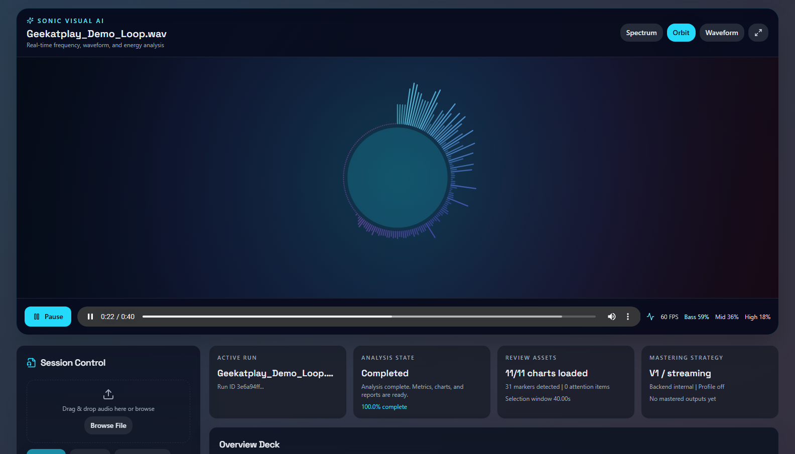
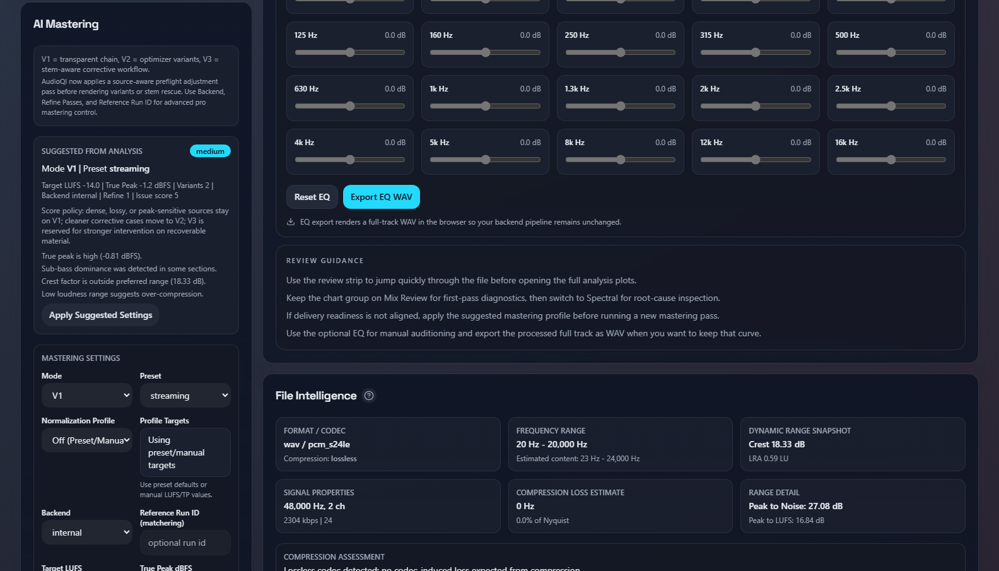
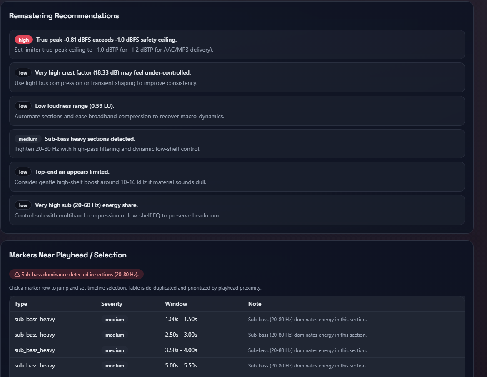
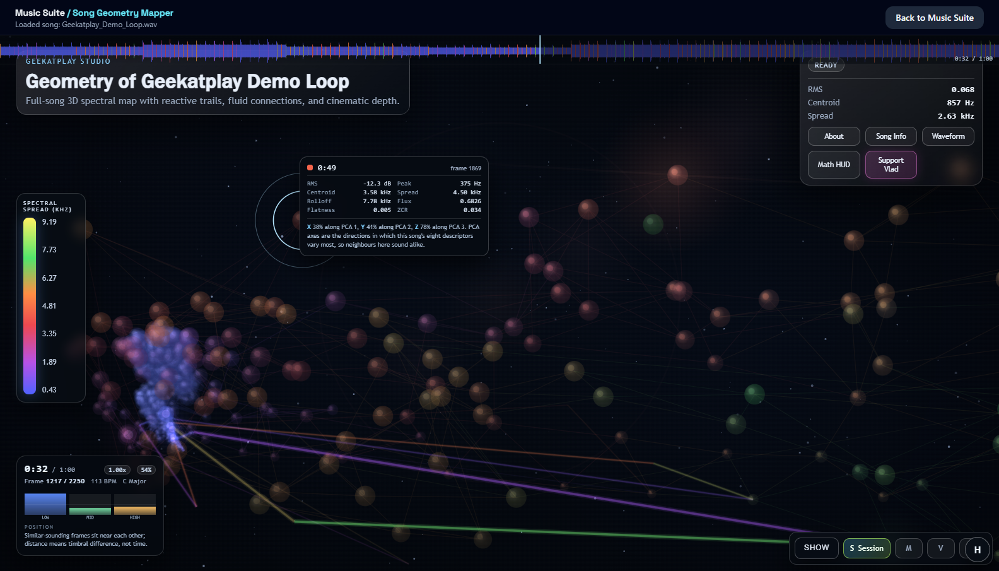
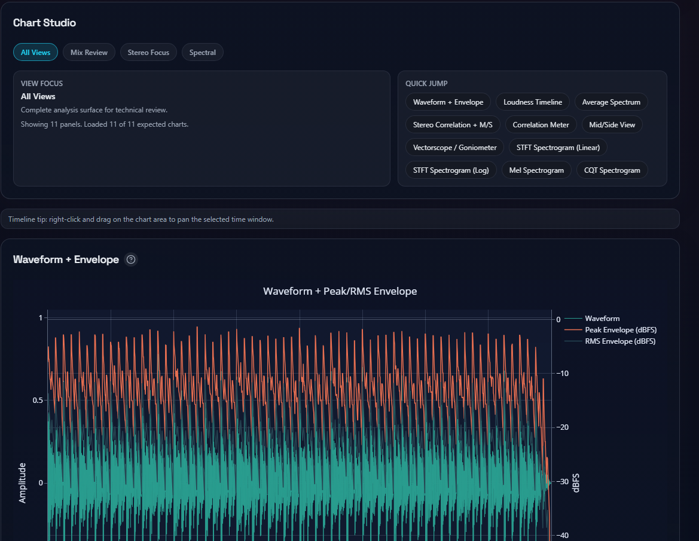
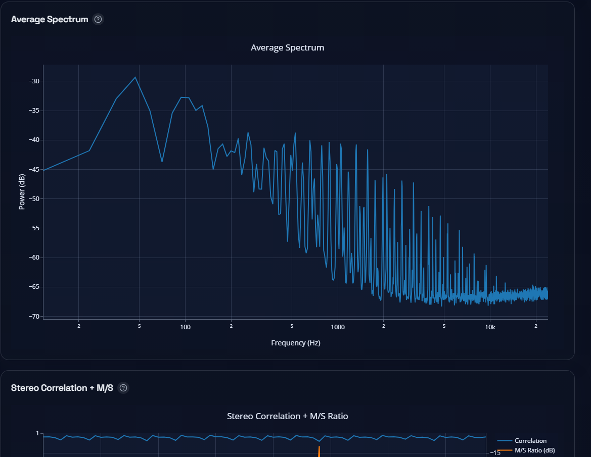

<div align="center">

# 🎛️ Geekatplay Studio Music Suite

**Local-first music analysis, AI-assisted mastering, real-time visualization, and 3D song geometry — in one application.**

[](LICENSE)
[](pyproject.toml)
[](apps/web-next/package.json)
[](apps/api/main.py)
[](apps/web-next)
[](GUARDRAILS.md)

Created by **Vladimir Chopine** · [GeekatplayStudio/music-suite](https://github.com/GeekatplayStudio/music-suite)



<sub>Song Geometry Mapper — a full-song 3D spectral map with an always-on readout, a seekable waveform scrubber, and structural arcs linking passages that recur.</sub>

</div>

---

## What it is

Music Suite is a desktop-style application that runs entirely on your own machine. Upload a track and it gives you broadcast-grade measurements, an explainable mastering chain, real-time visuals, and a 3D map of the song's spectral geometry — without uploading your audio anywhere.

The former **AudioQI Analyzer** and **Sonic Visual AI** projects now share one codebase, interface, installer, startup workflow, dependency set, and release lifecycle. Sonic Holodeck ships as an optional ComfyUI integration rather than a second application.

| | |
|---|---|
| 🎚️ **Measure** | Loudness (LUFS), true peak, crest, LRA, stereo correlation, phase, spectrum, and four spectrogram types |
| 🤖 **Master** | Internal, FFmpeg, Pedalboard, and Matchering paths with marker-aware refinement and rollback |
| 🌈 **Visualize** | 60 FPS Spectrum, Orbit, and Waveform modes driven by the Web Audio analyser |
| 🪐 **Map** | Full-song 3D geometry with tempo and key estimation, structural repeat detection, per-node inspection, presets, overlays, and exports |
| 🧠 **Describe** | Local Ollama model writes the track's style, always shown beside the description derived from the measurements |
| 🔌 **Integrate** | Guarded local MCP server, plus optional ComfyUI nodes for music generation |
| 🔒 **Stay local** | Loopback-only binding, no cloud calls for audio, explicit opt-in for every mutation |

---

## Screenshots

### Unified workspace

Upload, analysis state, delivery readiness, and the waveform review strip on one surface.



### Real-time Visual AI

Spectrum and Orbit modes render from live playback at 60 FPS with per-band energy readouts.

<table>
<tr>
<td width="50%"></td>
<td width="50%"></td>
</tr>
<tr>
<td align="center"><sub>Spectrum</sub></td>
<td align="center"><sub>Orbit</sub></td>
</tr>
</table>

### AI mastering with explanations

Every suggestion states its reasoning, and the source-aware preflight explains why a mode and preset were chosen.



### Actionable remastering notes

Findings are ranked by severity and tied to concrete time windows rather than generic advice.



### Song geometry you can read

Every point is one analysis frame. Hover any node for its eight spectral descriptors and a sentence explaining why the active mapping mode placed it at that coordinate — the axes are never left unexplained.



The lower-left readout carries elapsed time, playback rate, position, frame index, a low/mid/high band meter, and the estimated tempo and key. **Both estimates carry a confidence and read `unclear` rather than printing a number the data does not support** — tempo comes from autocorrelating the spectral-flux onset envelope, key from Krumhansl-Schmuckler correlation over a long-window chroma.

### Chart studio

Eleven interactive Plotly panels grouped into Mix Review, Stereo Focus, and Spectral views.

<table>
<tr>
<td width="50%"></td>
<td width="50%"></td>
</tr>
</table>

<sub>Screenshots show a synthetic demo loop generated for documentation, so no third-party music appears in this repository.</sub>

---

## Requirements

- Windows 10/11 or a current macOS release
- Python 3.11 or newer
- Node.js 20.9 or newer
- pnpm (recommended) or npm
- FFmpeg and ffprobe on `PATH`
- Git for in-app updates
- Optional: ComfyUI with a compatible Torch/CUDA environment

---

## Quick start

### Windows

Double-click `install.bat`, then `start.bat`. Stop it with `stop.bat`.

The `.bat` files call the unified PowerShell implementation. Advanced flags stay available:

```powershell
.\install.ps1 -WithGpu
.\install.ps1 -WithPro
.\install.ps1 -ComfyUIPath "D:\ComfyUI" -InstallComfyDependencies
```

### macOS

Double-click `install.command`, then `start.command`. Use `stop.command` or press Control-C in the startup terminal. If macOS blocks the first launch, Control-click the file, choose **Open**, and confirm.

```bash
./install.command
./start.command
./stop.command
```

Install FFmpeg with Homebrew when needed:

```bash
brew install ffmpeg
```

### From the project root with npm

Works on both platforms and calls the same unified launchers:

```bash
npm run start
npm run stop
npm run install:suite
```

---

## Ports, startup time, and logs

**Ports.** Music Suite prefers `http://127.0.0.1:3000` for the interface and `8008` for its local API. If either is occupied, startup scans upward for the next free loopback port; if that whole window is busy it asks the operating system for any free port. It then displays and opens the selected address. **The application already on your preferred port is never stopped or modified.**

**Startup time.** A cold first start imports the complete audio stack and can take a few minutes on a slow disk, or while antivirus scans the virtual environment. The launchers wait up to **300 seconds** per service and print progress while waiting.

**Logs.** Each service streams to `logs/`:

```text
logs/api.log        logs/api.error.log
logs/web.log        logs/web.error.log
```

If a service fails or times out, the launcher prints the tail of that log instead of an unexplained message. Raise the limit when needed:

```powershell
.\start.ps1 -StartupTimeoutSeconds 600
```

```bash
MUSIC_SUITE_STARTUP_TIMEOUT_SECONDS=600 ./start.command
```

The `MUSIC_SUITE_STARTUP_TIMEOUT_SECONDS` environment variable sets the same value once on either platform.

**Shutdown.** `stop` reads `.music-suite-processes.json` and terminates only the verified PIDs recorded for that project instance and their descendants. It never claims ports 3000/8008, and an unrelated process using either port is left running.

---

## Application workflow

1. Upload or drag in a song.
2. Select **Analyze** for technical and mastering analysis.
3. Select **Visual AI** for the live Spectrum, Orbit, and Waveform experience.
4. Select a run and open **Geometry Mapper** to reuse that song in the full 3D workspace.
5. Use **AI Mastering** to render and compare mastered outputs.
6. Open **Configuration** to check for updates from the official repository.

The frontend reaches the selected API through a same-origin streaming proxy, so uploads, audio seeking, downloads, MCP discovery, and configuration work without fixed port assumptions. The installer creates an optimized production frontend, and normal startup uses `next start` without development hot-reload WebSockets.

Geometry Mapper runs inside the normal Music Suite web process — Docker and a separate mapper server are not required. Classic analysis runs in the browser; Voice / Deep analysis uses the same loopback FastAPI service and caches under `data/song-mapper`. Optional Demucs stem separation can be enabled with `pip install -e ".[geometry]"`; without it the analyzer falls back to the full mix.

### Inside the mapper

- **Mapping modes** decide how eight descriptors become three coordinates. *Manifold (PCA)* answers "what sounds like what" — distance is timbral difference and time is not an axis. *Time Spine* answers "what happened when". *Hybrid Flow* keeps chronology while pulling repeats together. *Helix Orbit* winds the timeline into a spiral. The About panel and `docs/HELP_GUIDE.md` set out the axes for each.
- **Time as a visible dimension** — temporal fog that fades by distance from the playhead *in time* rather than from the camera, ghost layers showing where the music was and is heading, a time tube encoding loudness along the trail, and section arcs linking passages that recur.
- **Connections are waveforms**, not ropes: a fundamental plus partials whose weighting comes from each frame's own spectral flatness, so tonal passages draw near-pure sine and percussive ones draw a dense, ragged wave.
- **Scene styles** — an X-Ray mode that composites rim outlines additively so dense clouds stay readable, and a colour haze whose hue follows spectral centroid and whose density follows loudness.
- **AI music style** — with a local Ollama model running, the Session tab describes the track's genre, instrumentation, mood and production. The rule-based description derived from the measurements is always shown too, because a language model will confidently name a genre the numbers do not support. No local model is a normal state, not an error.
- **Playback 0.05x–2x** on the audio clock, so trails and ribbons keep their shape at every speed and pausing freezes the scene for inspection.
- **Camera** — scroll to zoom 0.12x–4x, drag to orbit or pan, `F` to frame the whole cloud.

No third-party JavaScript is used anywhere in the mapper: it is vanilla ES modules and Canvas 2D, so it runs offline from a folder with no CDN, no build step, and no supply chain.

---

## Safe in-app updates

The Configuration panel checks only:

```text
https://github.com/GeekatplayStudio/music-suite
```

Updates are available to Git clones. The updater:

- accepts only the official repository as `origin`;
- uses the stable `main` branch;
- permits fast-forward updates only;
- refuses to overwrite a dirty or diverged working tree;
- requires an explicit same-origin confirmation header;
- never executes a user-provided URL or branch.

After an update, restart Music Suite. The start launcher fingerprints the Git revision, `pyproject.toml`, and `pnpm-lock.yaml`, then synchronizes dependencies and the production build when needed. ZIP installations can update by downloading a new release, but Git clones are recommended.

---

## Project layout

```text
music-suite/
  apps/api/                          FastAPI analysis and mastering backend
  apps/mcp/                          guarded MCP server
  apps/web-next/                     Next.js interface and Visual AI
    public/song-mapper/              integrated Song Geometry Mapper workspace
  audioqi/                           analysis, mastering, update, and integrations
    geometry_mapper/                 mapper deep-analysis and managed cache service
    integrations/comfyui/
      sonic_holodeck/                bundled ComfyUI nodes and workflows
  docs/images/                       README screenshots
  tests/                             backend, security, MCP, and launcher tests
  scripts/launch.mjs                 cross-platform bridge for the root npm scripts
  logs/                              per-service startup logs (generated, Git-ignored)
  package.json                       root npm start/stop/install wrappers
  install.bat / start.bat / stop.bat simple Windows launchers
  install.command / start.command / stop.command   simple macOS launchers
  install.ps1 / start.ps1 / stop.ps1 unified Windows implementation
```

---

## MCP server

Start Music Suite, then configure an MCP client to launch the installed `music-suite-mcp` executable:

```text
Windows:  <music-suite>\.venv\Scripts\music-suite-mcp.exe
macOS:    <music-suite>/.venv/bin/music-suite-mcp
```

Available tools are `music_suite_status`, `list_analysis_runs`, `get_analysis_result`, `get_mastering_advice`, and `queue_analysis`. MCP uses stdio and is read-only by default. Queueing an existing run requires `MUSIC_SUITE_MCP_ALLOW_MUTATIONS=1`.

See **[GUARDRAILS.md](GUARDRAILS.md)** for the complete enforced security boundary.

---

## Validation

Run the complete Windows quality gate:

```powershell
.\verify_pipeline.ps1
```

Individual checks:

```powershell
.\.venv\Scripts\python.exe -m pytest -q --basetemp .pytest_tmp
.\.venv\Scripts\python.exe -m ruff check . --ignore E501
cd apps\web-next
pnpm.cmd exec tsc --noEmit
pnpm.cmd lint
pnpm.cmd build
pnpm.cmd audit --prod
cd public\song-mapper
node --test "tests/*.test.js"
```

The mapper's own unit tests cover the pure analysis helpers — tempo and key
estimation, chroma folding, and the visual density maths — including the cases
where an estimate must be refused rather than guessed.

Further reading: [Help guide](docs/HELP_GUIDE.md) · [Competitive analysis](docs/MAPPER_COMPETITIVE_ANALYSIS.md) · [Product requirements](docs/PRD.md) · [Technical requirements](docs/TRD.md) · [References](docs/REFERENCES.md)

---

<div align="center">

### Credits and license

**Geekatplay Studio Music Suite**<br>
Created and maintained by **Vladimir Chopine**<br>
Copyright © 2026 Geekatplay Studio

Released under the [MIT License](LICENSE).

</div>
