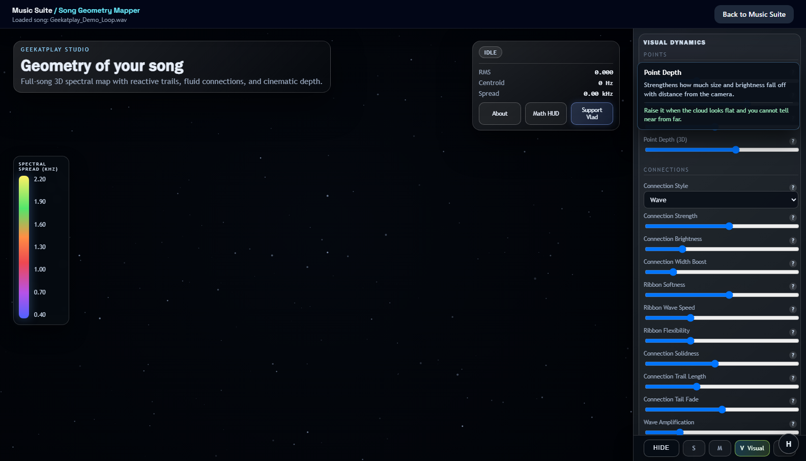

# Geekatplay Studio Music Suite Help Guide

**Created by Vladimir Chopine · Geekatplay Studio**

## 1) Session Control

- `Upload`: stores source audio and metadata.
- `Analyze`: runs offline DSP analysis asynchronously.
- `Use optional GPU spectrogram path`: enables optional CUDA spectrogram route if available.
- `Clear History`: removes completed runs.
- `Hard Reset`: cancels queued/running jobs and clears all runs.
- `Hard Reset` also resets in-process worker state so stalled jobs do not remain pinned at high progress values.

## 2) Analysis Stages (Ticker)

Typical stage flow:

- `uploaded`
- `queued`
- `initialize`
- `metadata`
- `decode`
- `scan`
- `dynamics`
- `markers`
- `spectrograms`
- `charts`
- `report_*`
- `finalize`
- `completed`

If stage heartbeat stalls for too long, loop guard marks the run as failed to prevent silent hangs.

Stage detail text is expected to change during long phases (`spectrograms`, `charts`, `report_*`).
For long spectrogram work, the frontend warning is intentionally less aggressive than the backend loop guard.
If percentage remains fixed and stage detail does not update for an extended period, use `Hard Reset`.

## 3) AI Mastering Controls

- `Mode`
  - `v1`: safest transparent path for dense, lossy, clipped, or peak-sensitive sources
  - `v2`: optimizer variants + best candidate selection for cleaner corrective cases
  - `v3`: stem-aware spectral workflow for difficult but still recoverable material
- `Preset`
  - `streaming`, `club`, `film`, `voice`
- `Backend`
  - `internal`: deterministic built-in DSP chain and current default
  - `auto`: advanced runtime selection path
  - `ffmpeg`: ffmpeg filter-chain pass
  - `pedalboard`: optional pedalboard plugin path
  - `matchering`: optional reference-based path (requires `Reference Run ID`)
- `Target LUFS`: mastering loudness target
- `True Peak dBFS`: output ceiling target
- `V2 Variants`: candidate count for mode `v2`
- `Refine Passes`: bounded marker-aware correction passes (`1..5`)
- `Reference Run ID`: optional analyzed run id to use as mastering reference
- `Source-Aware Adaptation`: before rendering outputs, the engine can nudge de-essing, low/high spectral targets, compression, limiter drive, and peak headroom from detected source issues
- `Iterative Normalization`: output loudness is measured after limiting and searched toward the requested LUFS target while staying under the configured true-peak ceiling
- `Suggested Settings`: analyzer advice now includes safer mode, preset, backend, and refine-pass recommendations

Important behavior:

- Manual `Target LUFS` and `True Peak dBFS` remain the primary user controls.
- Adaptation is conservative and is designed to reduce obvious source problems before the main mastering pass.
- Extra true-peak headroom may be introduced automatically when clipping or high true-peak risk is detected.
- Normalization is no longer a single gain pass; the engine now measures post-limiter loudness and chooses the closest valid result.
- Suggested settings now default to `internal` and lower refine counts unless the source looks clean enough to justify stronger correction.

## 4) Post-Master Self-Check

- `Assessment`
  - `strong_improvement`: major reduction in issue score
  - `partial_improvement`: smaller but measurable improvement
  - `unchanged`: no measurable gain
  - `regression`: quality score worsened; rollback logic should prevent this in final output
- `Issue score X -> Y`: weighted issue classes before/after mastering
- `Resolved`: issue classes removed after mastering
- `Remaining`: issue classes still present
- `Worsened`: issue classes that increased
- `Recommended fixes`: follow-up actions when mastering alone cannot fully resolve issues
- `Compliance`: verifies LUFS target distance, true-peak ceiling distance, and crest-density risk after mastering
- `Post-check rescue`: if the first pass still fails compliance badly, AudioQI can rerender from source with a stricter rescue configuration and keep it only if the result improves

## 5) Refinement Diagnostics

- `accepted / max`: successful correction passes vs configured pass limit
- `rollbacks`: non-improving pass attempts discarded
- `stem fallback applied`: whether stem rescue pass improved result and was kept
- `backend selected`: actual backend used after runtime availability checks
- `source-aware adaptation`: preflight parameter changes applied before the main mastering render
- `recommended backend/refine passes`: analyzer-provided safer starting point for the current source

A pass is accepted only if it improves the weighted marker load **and** does not
materially worsen `harshness_band`, `clipping`, `true_peak_risk`, or
`mono_incompatibility`. Those four are refused regardless of aggregate score,
because added glare or clipping cannot be recovered downstream. A high rollback
count therefore means no safe improvement was available, not that nothing was
tried.

## 5b) Mastering Progress Stages

Mastering reports the step it is starting, so a long job is legible rather than
a single frozen percentage. State also carries `started_at` and
`stage_started_at` so the UI can show how long the *current* step has run.

| Stage | Meaning |
| --- | --- |
| `load_source` | Decoding source audio |
| `profile_source` | Measuring loudness, dynamics, spectral balance |
| `adapt_settings` | Adapting the chain to this material |
| `*_highpass` | Filtering sub-sonic rumble below 24 Hz |
| `*_tilt` | Spectral tilt and tonal balance |
| `*_deess` | De-essing sibilance |
| `*_compress` | Broadband compression |
| `*_limit` | Normalising to loudness and true-peak targets |
| `refine_pass_N` | Marker-aware corrective pass N |
| `rollback` | Last pass was not an improvement and was discarded |
| `stem_fallback` | Stem-rescue pass |
| `self_check` | Re-measuring the finished master |

The chain prefix names which pass is running: `chain_*` for a single master,
`variantN_*` while evaluating optimizer variant N in `v2`, and `stem_bass_*`
and friends while processing stems in `v3`. Limiting is normally the longest
single stage.

## 6) Marker Categories

- `clipping`: hard clip segments
- `true_peak_risk`: true peak exceeds target safety margin
- `loudness_dip`: short-term loudness falls below target window
- `harshness_band`: persistent 3k-9k energy spikes
- `sub_bass_heavy`: excessive 20-80 energy share
- `mono_incompatibility`: negative stereo correlation regions

`harshness_band` and `sub_bass_heavy` are **shares of total energy**, so they
compete: reducing dominant sub-bass lowers total energy and therefore raises the
3–9 kHz share even when the absolute 3–9 kHz content has not changed. Judge a
master by the self-check's `resolved` / `improved` / `worsened` sets together,
not by one marker type in isolation.

## 7) Timeline Selection and Marker Review

- The playhead timeline supports a segment selection (`start`, `end`).
- Marker table near playhead is de-duplicated and prioritized by proximity to current cursor/selection.
- Clicking a marker row jumps playback and updates the active timeline selection.
- Selection-aware charts (waveform, loudness, stereo, spectrogram views) highlight or zoom around the selected window.

## 8) Export, Conversion, and Save Behavior

- Conversion and mastering outputs are generated under run artifacts first.
- Save/download prompts should appear only after processing reaches `completed`.
- A single explicit output selection should trigger a single file save action.
- If multiple save prompts appear unexpectedly, refresh run detail and verify only one output id is selected.

## 8b) Song Geometry Mapper

- **Per-control help**: rest the pointer on any adjustment for about half a second to get a popup describing what it does and when to reach for it. Keyboard focus shows the same help; `Esc` dismisses it.
- **Playback speed**: the Session tab exposes 0.05x-2x plus 0.1x / 0.25x / 0.5x / 1x / 2x presets. `[` and `]` step the rate, `\` returns to 1x, and the choice persists between sessions.
  - Trail persistence, pulse decay, and ribbon motion run on the *audio* clock, so a trail looks the same at 0.25x as at 1x — it simply advances more slowly.
  - Pausing freezes the trail instead of letting it fade, so a single moment can be inspected.
  - `Preserve pitch` is on by default; turn it off for tape-style pitch shifting.
- **Controls are docked** to a resizable right-hand column on displays 900px and wider, so they never cover the geometry. Drag the divider to resize, or use `Hide` to reclaim the full width. Narrower screens keep the original bottom sheet.
- **Song Info** (lower left, toggled from the top bar) shows elapsed/total time, playback rate, position, frame index, a low/mid/high band meter with peak hold, and the estimated tempo and key. Both estimates carry a confidence and read `unclear` rather than printing a number the data does not support.
- **Waveform strip** (top, toggled from the top bar) is the whole song's peak envelope tinted by the active colour metric. Click or drag anywhere in it to seek. Imported and backend-analysed maps have no sample-level envelope, so those fall back to the per-frame RMS curve.
- **Node inspector**: rest the pointer near any node to see that frame's eight descriptors plus a sentence explaining why the current mapping mode put it at that coordinate.
- **Camera**: scroll to zoom (0.12x-4x), drag to orbit or pan, `F` or `Reset Camera` frames the whole cloud.

### How a frame becomes a point in space

Each analysis frame is one node. Eight descriptors are measured per frame — RMS, spectral centroid, spread, rolloff, flatness, zero-crossing rate, peak frequency, and flux — and the mapping mode decides how those eight numbers become three coordinates:

| Mode | X | Y | Z | Answers |
| --- | --- | --- | --- | --- |
| Manifold (PCA) | 1st principal component | 2nd, nudged by loudness | 3rd, nudged by flux | "What sounds like what" — distance is timbral difference, time is not an axis |
| Time Spine | Elapsed time | Peak frequency, lifted by centroid | Spread + tonality + loudness + flux | "What happened when" |
| Hybrid Flow | Time arc blended 62% toward PC1 | Time blended 46% toward PC2 | Arc depth blended toward PC3 | Chronology you can follow, with repeats bending together |
| Helix Orbit | cos(angle) × radius | Elapsed time along the spiral | sin(angle) × radius | Fixed span per turn; loud, wide passages bulge outward |

PCA picks the three directions in which *this* song's descriptors vary most, so the axes carry the most available information rather than being an arbitrary choice of three descriptors. `3D Frequency Spread` scales X and Z, and the X/Y/Z offsets shift the cloud bodily; neither changes what the axes mean.

### Time and structure

- **Temporal Fog** fades nodes by distance from the playhead *in time*, unlike `Fog Depth` which follows the camera — so it keeps working while you orbit.
- **Ghost Layers** draw faint echoes of the cloud N seconds behind (cool) and ahead (warm).
- **Time Tube** extrudes the trail into a ribbon whose thickness is loudness.
- **Section Arcs** link moments that sound alike but sit far apart in the song, taken from the nearest-neighbour graph. A verse/chorus track shows many; a through-composed piece shows almost none. The Math HUD reports how many were found.

### AI music style

The Session tab describes the track's style from its measured features.

- If a local **Ollama** model is running on loopback it writes the description; the panel probes on load and names the model it will use. Vision, embedding and code models are skipped because they cannot describe music usefully.
- A **rule-based description derived from the measurements is always produced and always shown**, even when a model answers. A language model will confidently name a genre the numbers do not support, so both are visible and it stays clear which claims trace to a measurement.
- No local model is a normal state, not an error — the measured description still appears.
- Requests go through the Music Suite API, never from the browser to Ollama directly, and carry explicit time and output-token budgets.

## 9) Troubleshooting

- `Failed to fetch`:
  - confirm the API is running; startup prefers port `8008` but auto-selects the next free loopback port
  - the browser always calls the same-origin `/suite-api` proxy, so no public API URL needs to be configured
  - check the selected API port in `.music-suite-processes.json` and the launcher output
- `<service> did not open port <n> within <n> seconds`:
  - a cold first start imports the full audio stack and can take minutes on a slow disk or while antivirus scans `.venv`
  - read `logs/api.log`, `logs/api.error.log`, or `logs/web.log` for the real failure
  - raise the limit: `.\start.ps1 -StartupTimeoutSeconds 600`, or `MUSIC_SUITE_STARTUP_TIMEOUT_SECONDS=600 ./start.command`
- `npm error enoent ... package.json` when running `npm run start`:
  - run it from the project root, which now provides `npm start` and `npm stop` wrappers around the unified launchers
- `Stage heartbeat is stale`:
  - long mel spectrogram work can legitimately take time
  - the frontend warning is advisory; the backend loop guard is the actual stall detector
  - if a fresh run still stays pinned on `Computing mel spectrogram.` for several minutes, capture the new run id before using `Hard Reset`
- `Mastering looks stuck on one percentage`:
  - it is almost certainly still working. Mastering reports each step it starts and how long that step has been running, so check whether the in-stage timer is advancing before assuming a hang
  - the limiting step (`Normalising to loudness and true-peak targets`) is the longest single stage — on the order of 20 s per minute of audio — so on a full-length track it holds one percentage for a while
  - `v2` runs the whole chain once per optimizer variant, so its total time scales with `Optimizer Variants`
  - a genuinely hung job stops updating `stage_started_at`; the loop guard in `GET /runs/{id}/mastering` is the authority, not the bar
- `Mastering unchanged`:
  - inspect `Source-Aware Adaptation` and `Post-Master Self-Check` together
  - increase `Refine Passes` — the default of 1 applies the marker-aware correction only once, and harshness and sub-bass corrections benefit from iterating
  - move from `v1` to `v2` or `v3`
  - review remaining markers and apply mix-level fixes
  - passes that materially increase harshness, clipping, true-peak risk, or mono incompatibility are refused outright, so a run that reports several rollbacks may simply have found no safe improvement to make
- `More harshness_band markers after mastering than before`:
  - check the absolute change, not just the count. `harshness_band` (3–9 kHz) and `sub_bass_heavy` (20–80 Hz) are both measured as a share of **total** energy, so they compete arithmetically
  - correcting a bass-heavy master reduces total energy, which raises the 3–9 kHz share even when the absolute 3–9 kHz content has not moved at all. A master that takes `sub_bass_heavy` from 71 windows to 2 will often show more `harshness_band` windows purely for this reason
  - read the `Post-Master Self-Check` counts as a set: `resolved`, `improved` and `worsened` together describe the trade, where one marker type alone does not
  - genuine added glare shows up as an increase in absolute 3–9 kHz energy, not only in the ratio
- `matchering not used`:
  - install optional `pro` extras
  - provide valid `Reference Run ID`
- `backend fallback`:
  - check `Pro modules` availability in mastering panel
- Audio sounds distorted only in app player:
  - verify source endpoint is streaming full file and browser is not pinned to a stale partial cache entry
  - check run metadata duration against source duration from media player/ffprobe
- Frequent `206 Partial Content` in API logs:
  - expected for browser media scrubbing/range requests; this does not mean the source file is truncated
